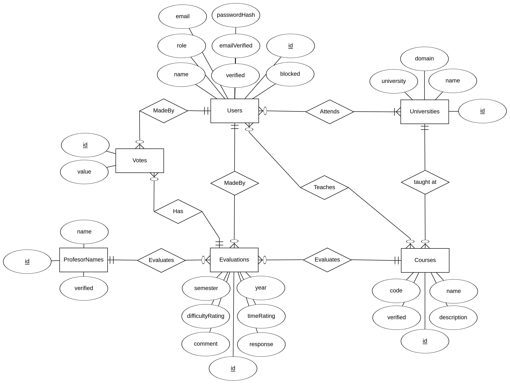

# [Heroku App](https://eva-cursos-netz.herokuapp.com/)
# [Heroku App que consume API](https://eva-cursos-netz.herokuapp.com/api-application)

# Cuentas
* `admin@uc.cl`: `pass`
* `student@uc.cl`: `pass`
* `professor@uc.cl`: `pass`

# Documentación Aplicación
## Requisitos:
* PostgreSQL
* Node.js versión>=v12.16
* Yarn

## Configuración
* Clonar el repositorio
* Instalar las dependencias con `yarn install`
* Instalar postgresql y craer una base de datos
* Agregar los datos de las base de datos a `src/config/database.js`
* Correr las migraciones con `./node_modules/.bin/sequelize db:migrate`
* Correr las seeds con `./node_modules/.bin/sequelize db:seed:all`

## Ejecutar la App
* Para ejecutar de forma normal usar el comando `yarn start`
* Para ejecutar en modo dev usar el comando `yarn dev`
* Abrir `http://localhost:3000` en el navegador

## Arreglar problemas
* Reinstalar dependencias:
  * Borrar la carpeta `node_modules`
  * Correr `yarn install`
* Resetear base de datos:
  * `./node_modules/.bin/sequelize db:migrate:undo:all`
  * `./node_modules/.bin/sequelize db:migrate`
  * `./node_modules/.bin/sequelize db:seed:all`
  
## Modelo de datos

# Documentación API

| path | method | descripción | form-data params in body | url-encoded query params | returns | requiere accessToken en header | 
|---|---|---|---|---|---|---|
| /api/auth | post | permite obtener un accessToken | email, password | | json con accessToken | no |
| - | - | - | - | - | - | - |
| /api/universities    | get    | entrega todos las universidades | | | json con todas las universidades | no |
| /api/universities/id | get    | entrega universidad con `id`    | | | json con una universidad | no |
| /api/universities    | post   | crea una universidad            | code, name, domain | | json con link de la universidad | si |
| /api/universities/id | patch  | modifica universidad con `id`   | opcionales: code, name, domain | | json con link de la universidad | si |
| /api/universities/id | delete | elimina universidad con `id`    | | | | si |
| - | - | - | - | - | - | - |
| api/courses/         | get    | entrega todos los cursos |  |  | json con todos los cursos | no |
| api/courses/         | get    | entrega todos los cursos de una universidad |  | UniversityId | json con cursos de una universidad | no |
| api/courses/id       | get    | entrega curso con `id` |  |  | json con un curso | no |
| api/courses/         | post   | crea un curso | code, name, description, UniversityId |  | json con link del curso | si |
| api/courses/id       | patch  | modifica curso con `id` | opcionales: code, name, description, UniversityId |  | json con link del curso | si |
| api/courses/id       | delete | elimina curso con `id` |  |  | | si |
| - | - | - | - | - | - | - |
| api/evaluations/     | get    | entrega todas las evaluaciones |  |  | json con todas las evaluaciones | no |
| api/evaluations/     | get    | entrega todas las evaluaciones de un curso |  | CourseId | json con evaluaciones de un curso | no |
| api/evaluations/id   | get    | entrega evaluación con `id` |  |  | json con una evaluación | no |
| api/evaluations/     | post   | crea una evaluación | CourseId, ProfessorNameId, year, semester, comment, timeRating, difficultyRating |  | json con link de la evaluación | si |
| api/evaluations/id   | patch   | modifica evaluación con `id` | opcionales: CourseId, ProfessorNameId, year, semester, comment, timeRating, difficultyRating |  | json con link de la evaluación | si |
| api/evaluations/id   | delete | elimina evaluación con `id` |  |  | | si |

